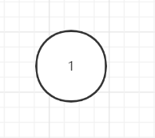
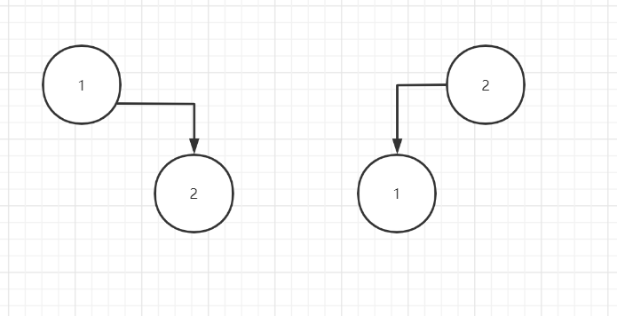
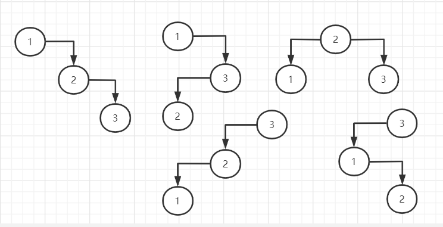

# Binary tree

## 96 Unique Binary Search Trees

给定一个整数n，返回不同结构的binary tree的数量

例如n为1时返回1

n为2时，返回2

n为3时，返回5

解法一：递归

定义一个函数numTrees()返回答案

则以n=3为例，numTrees(3)= numTrees(0)*numTrees(2) + numTrees(1) * numTrees(1) + numTrees(2)*numTrees(0)

numTrees(2) = numTrees(0) * numTrees(1) + numTrees(1) * numTrees(0)
